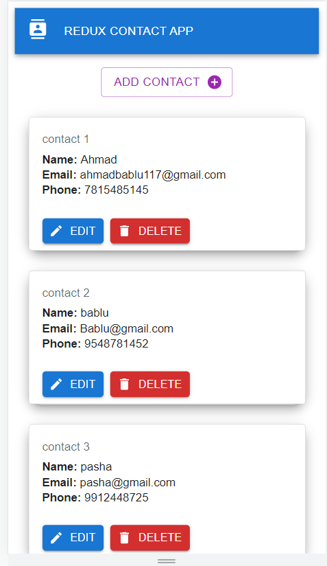
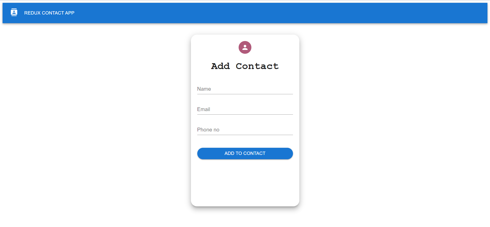
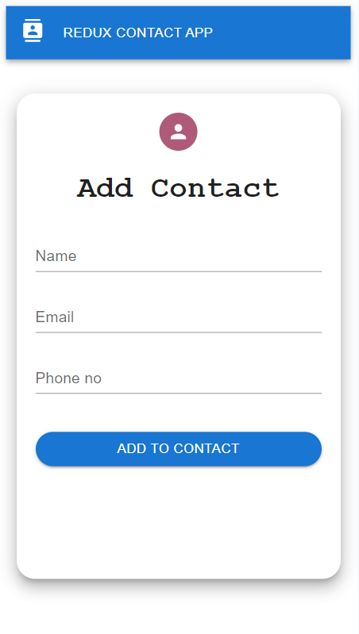

# Redux-Contact-App
This is a contact application made with reduxtoolkit and MaterialUI where crud operations are exposed with controlled form for validations to adding contacts and updating contacts.used react toastify for displaying errors as a toast message.
this project contains react-router-dom,material ui ,react toastify and vite js as development dependency

# How to run this Project
run "npm install" Command in terminal after changing to the root directory in terminal
& run "npm start" to run the development server

# Home Page Desktop

# Home Page Mobile

# Add Contact Page Desktop

# Add Contact Page Desktop

# Edit Contact Page Desktop

# Edit Contact Page Mobile

